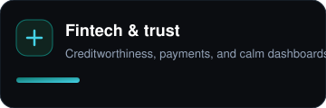
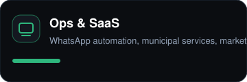

<div align="center">

  

  <br/>

  <a href="https://github.com/yuzzothecreator">
    
  </a>
  <a href="https://github.com/yuzzothecreator1">
    
  </a>
  

</div>

<br/>

### About

I design and ship **production SaaS** with calm interfaces and secure foundations — fintech trust scoring, cybersecurity command centers, municipal platforms, and automation products for East African teams.

**Creative minds. Secure solutions.**

<br/>

### Focus

<p align="center">
  
  &nbsp;
  
  &nbsp;
  
</p>

<br/>

### Featured work

| Product | What it does | Stack |
| --- | --- | --- |
| [**Securox**](https://securox.vercel.app) · [`securox`](https://github.com/yuzzothecreator/securox) | Cybersecurity command center — threats, incidents, training, risk | Next.js · TypeScript |
| [**Link-Up**](https://github.com/yuzzothecreator/Link-Up) | Digital trust scoring for small businesses and lenders | Next.js · Fintech |
| [**Rasimisha**](https://ditrtms.vercel.app) · [`Rasimisha`](https://github.com/yuzzothecreator/Rasimisha) | Tanzanian municipal services — IDs, payments, RBAC dashboards | Next.js · Supabase |
| [**Wagwan**](https://github.com/yuzzothecreator/Wagwan) | WhatsApp automation, AI inbox, CRM for East African businesses | Next.js · SaaS |
| [**4ward**](https://github.com/yuzzothecreator/4ward) | Student & developer marketplace for IT projects | TypeScript · Marketplace |
| [**WareBox**](https://github.com/yuzzothecreator/WareBox) | Interactive labs that simulate real engineering work | Python · Learning |
| [**BigSMS**](https://bigsms.vercel.app) · [`BigSMS`](https://github.com/yuzzothecreator/BigSMS) | SMS communication platform for Africa | Next.js |
| [**Zutu Engine**](https://github.com/yuzzothecreator/Zutu-engine) | High-performance CLI media engine | Go |

<br/>

### Toolbox

```text
Languages   TypeScript · Python · Go · Java
Frontend    Next.js · React · Tailwind · shadcn/ui
Backend     NestJS · Spring Boot · FastAPI · Prisma · Drizzle
Data        PostgreSQL · Redis · Supabase · MinIO
Product     Auth · Payments · SMS · WhatsApp · Media pipelines
```

<br/>

### Activity

<p align="center">
  
  
</p>

<p align="center">
  
</p>

<br/>

### Currently building

- Calm, content-first streaming and media platforms
- Trust and security products with production-grade auth
- Developer tools and learning environments for real shipping skills

<br/>

<div align="center">

  **Open to collaboration on fintech, security, and East Africa SaaS.**

  <sub>Built with the same clarity standard as my product UIs.</sub>

</div>
